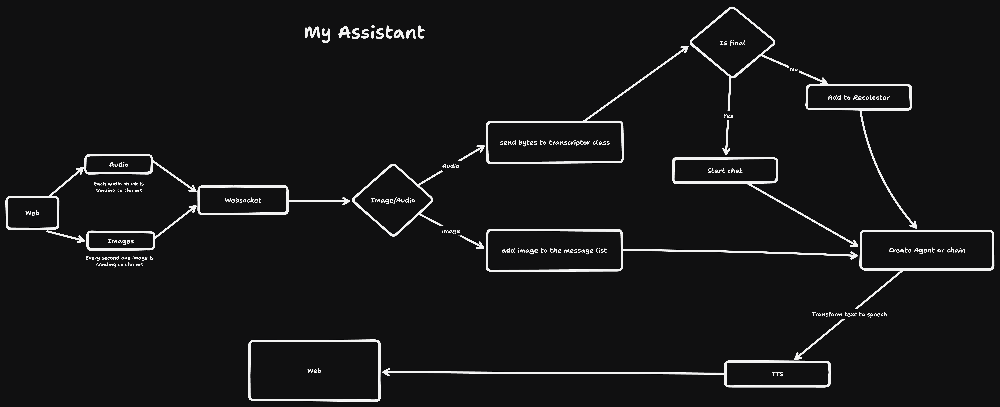

# My-Assistant
#### 🚨 Working in progress 

## Description

My-Assistant is a virtual assistant designed to provide real-time information to users based on voice and image inputs. Leveraging state-of-the-art technologies, My-Assistant can understand user queries and respond accurately and promptly.

## Features

- **Voice Recognition**: Utilizes Deepgram's advanced voice recognition capabilities to accurately capture and interpret user queries.
- **Image Processing**: Processes images to understand context and provide relevant information.
- **Real-Time Responses**: Delivers information to users in real-time, ensuring quick and efficient interactions.

## Tools and Technologies

- **Deepgram**: For voice recognition and processing.
- **OpenAI**: For natural language understanding and generating responses.

## Architecture



## Getting Started

### Prerequisites

- Install [Node.js](https://nodejs.org/) and [Next.js](https://nextjs.org/) -> Frontend 
- Install Python -> Backend
- Obtain API keys for [Deepgram](https://deepgram.com/) and [OpenAI](https://openai.com/)

### Installation

1. Clone the repository:
    ```bash
    git clone https://github.com/your-username/my-assistant.git
    ```

2. Install dependencies:
    ```bash
    cd my-assistant/frontend
    npm install
    ```

3. Install dependencies:
    ```bash
    cd my-assistant/backend
    pip install
    ```

4. Set up environment variables in backend folder:
    Create a `.env` file in the root directory and add your API keys:
    ```
    DEEPGRAM_API_KEY=your_deepgram_api_key
    OPENAI_API_KEY=your_openai_api_key
    ```

### Usage

1. Start the frontend application:
    ```bash
    npm start dev
    ```

2. Start the backend application:
    ```bash
    uvicorn main:app --reload
    ```

2. Interact with My-Assistant opening the browser:
    - Use a microphone to speak to the assistant.
    - Upload images for processing.
    - Receive real-time responses to your queries.

## Acknowledgements

- [Deepgram](https://deepgram.com/) for their voice recognition technology.
- [OpenAI](https://openai.com/) for their powerful natural language processing capabilities.

## Contact

For any questions or suggestions, please contact [josepaulct@gmail.com](mailto:josepaulct@gmail.com).

---

Happy assisting! 🚀
